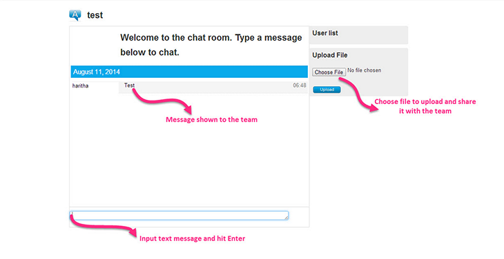

ScrumDo has an built-in chat tool to help teams communicate and share project artifacts. 

While this is an obvious advantage for teams that are geographically distributed, even teams that work in the same physical space can benefit from using it, because team members can discuss their thoughts with other team members and resolve conflicts in the moment without leaving the tool.

