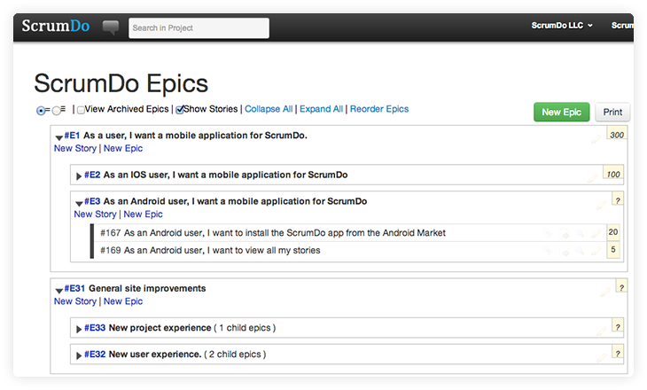
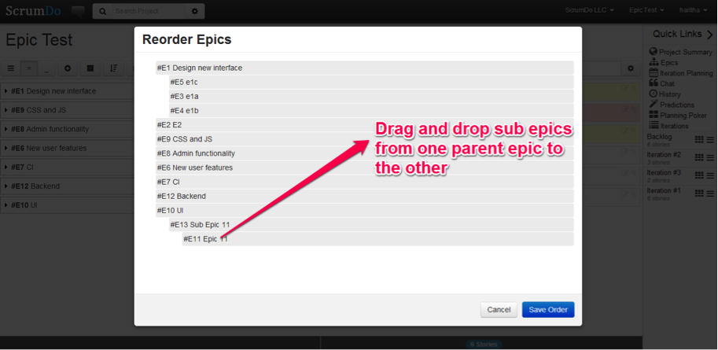
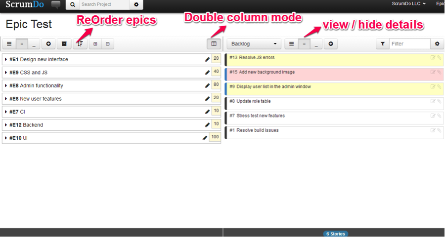

### Epics

#### What are epics

Epics are very large pieces of work that needs to be done. Good practice calls for us to break epics down into smaller chunks that we can accomplish within a relatively small time period.  You can nest epics within other epics to create a hierarchical work break down. Nested epics may be features for example.  Stories can be placed into epics at any nested level.

<i class="icon-reorder"></i> displays everything under selected epic

= hides the epic detail fields

_ hides the story list 

#### Organize, reorder, priortize your epics

You can drag and drop sub-epics among parents through the Reorder Epics window.  
Users can select the level of details to display under selected epics, sub-epics and stories by toggling among the options provided along the top of the interface:

#### Planning with your epics

  
The double column toggle allows users to view a story list on the right side panel.  Product planning is easy through the drag and drop functionality enabled by the dual column mode (and you can filter the story list if you’re looking for something specific).

