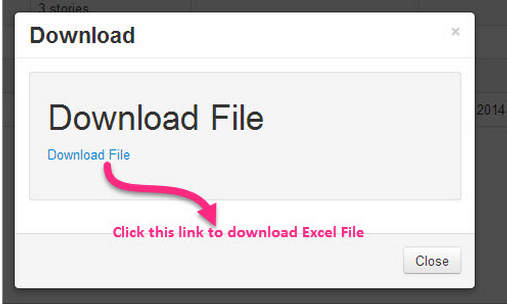

ScrumDo allows users to Export the Project or any selected Iteration to a file in order to complete bulk operations or perform sophisticated analysis of the data.

Authorized users can select the “Export Project” option in the project menu to save project contents to disk in the form of an Excel file. 

When you select the Export Project option from project menu, you’ll be presented with a pop up window where you can enter your desired file name for the download. Click on the export button, and ScrumDo generates an Excel file and displays a download link on the popup. 

Users can then click on this link to download and save the project on to their disk. The exported file contains all the stories in the backlog and the iterations, each iteration's details, tags used across the project, all the Epics. 

The “Export Iteration” option in the project menu works in similar fashion, but limits the information in the download to the data associated with a designated iteration.  Both options present ways to work on project and iteration details using an external tool, then checking those changes back in or importing info to other projects.  If you’re planning to update existing info, however, we strongly recommend “locking” your iteration.

Users are presented with the option to lock an iteration on the pop up display (by the way, if no iteration is selected, your full backlog is exported by default). 

