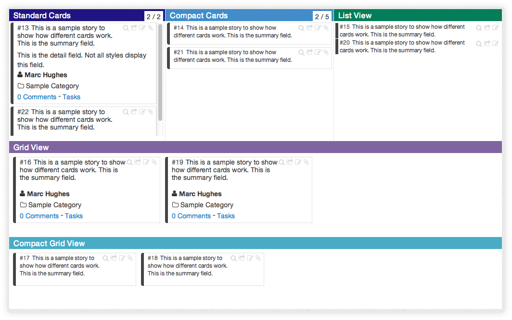
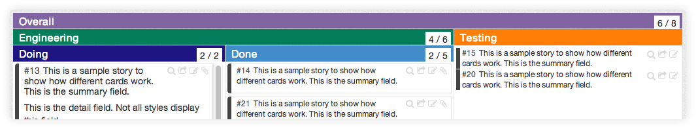

----

# Cards

With the introduction of the ability to create Scrumban based projects, 
ScrumDo is using the term "Card" instead of "Story".  A card is a representation 
of a unit of work.  In Flow based projects, you can set up custom card types under 
your project admin options.  Some common types include:

* User Stories
* Bugs
* Features

# Cells

Cells are where you place cards. They have a header with a label, and a body to place cards.

Your cell can have limits places on it, such as the number of cards, or the amount of points allowed.  These limits are displayed in the header of the cell.  These are often called WIP Limits, which stands for Work In Progress Limits.

Cells can be configured to have several card styles shown below.

## Headers

You can create 1-unit high cells that will have no body.  These are useful to apply a header across multiple cells.  When you create a header, you can associate it with one or more cells to apply WIP limits to.

----

# Report Profiles

Report Profiles are used to define the steps of work a unit of work must go through.  
ScrumDo uses Report Profiles to define the reports that can be run against your project.

A profile is made up of a series of steps.

Each step is associated with one or more cells on your board.

Since more than once cell can be associated with a step, 
and not all cells need to be accounted for, this gives you 
the ability to filter and summarize your reports.  For instance, 
you might set up a workflow for each class of service on your board, 
and a separate workflow that cuts across them all for an overall summary view.

