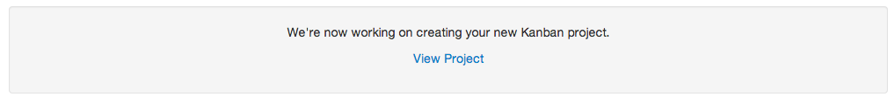

After you finish the wizard, it may take several minutes for your project to be migrated over.  It mostly depends on how many stories you have in your source project.  Once you see the "view project" link, the process is complete and you can view or modify your new project.

At this point, you can feel free to edit the default board that was generated for you, or start using your new project right away.

Once you have decided to migrate to you Flow based project, you'll probably want to archive your old Time-box based Scrum project so nobody uses it by accident, and also so it doesn't count against your subscription limits.