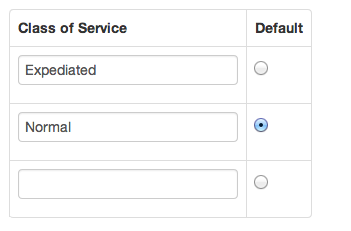

You can convert an existing ScrumDo Timebox based project into a Flow based project using our Project conversion wizard.  You can find this wizard on the project admin page for your scrum time box project.

###About the conversion process

<ul>
    <li><b>It's Safe</b> 
        
We will create a <b>copy</b> of your project, your original project will not be modified.

    </li>
    <li><b>Easy Wizard</b>
        
You will go through a three step wizard to set up options for your project.

    </li>
    <li><b>Low Risk</b>
        
If you don't like the new project, you're free to delete or archive it.

    </li>
</ul>   

###Classes of Service

The first decision you'll need to make while converting your project is what classes of service you'd like your new project to have.

You can define up to 9 difference classes of service (as you enter a one, a new entry will appear).

A class of service represents a flow of work through your process. They will be visually represented on your board as separate swim lanes. You could use them for things such as:

* Work priority (expediated vs. normal) This is the most common option
* Types of work (feature vs. bug fix)
* By team assigned

Your story statuses will automatically be set up as steps in your workflow and form the columns of your initial board.

The default class of service will have a taller row than the others, but you can always edit sizing after you're done with the import.

[Next Step](kanbanize_wip.html)
