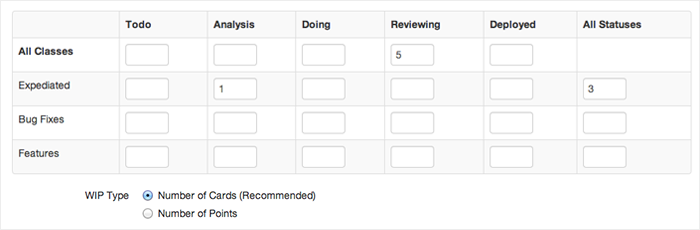

While converting an existing Scrum project to a Scrumban project, you will be asked to specify WIP limits in a table format like
the one below.

In our example above, we had defined 3 classes of service (Expediated, Bug Fixes, and Features) and our project had 5 story statuses already defined (Todo, Analysis, Doing, Reviewing, Deployed).  You can see these along the top and left sides of the grid.

To define a WIP limit for a specific class of service and status combination, simply fill in the corresponding grid cell.  In our example, there is a "1" in the cell that is the second down and second from the left, it indicates that there should never
be more than one cards in the Analysis state for the Expediated class of service.

There is a special row at the top labeled "All Classes".  These WIP limits correspond to a specific story status but across all of the classes of service.  The "5" in the example means that there should never be more than 5 cards in reviewing, no matter what class of service they are in.

There is a special column on the right labeled "All Statuses" and represents the inverse of the "All Classes" row.  The "3" means there should never be more than 3 cards in the entire Expediated class of service.

[Next Step](kanbanize_done.html)
