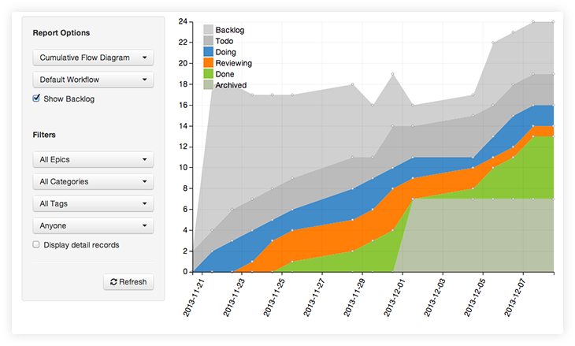

The Cumulative Flow Diagram, or CFD, allows you to see how the work has progressed through the system over time.

The height of each band gives you an indication of the work in progress at a given time, and the horizontal distance from one band to another will tell you the lead time of that work.

You can change what steps are shown by selecting a workflow from the selection box towards the top.  Every custom workflow that you defined while creating your board will be listed here.

You can filter what work gets shown by selecting the filter options towards the bottom.  For instance, you could filter down to work done against a single epic and assigned to a specific person.