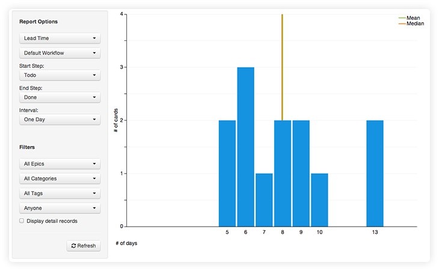
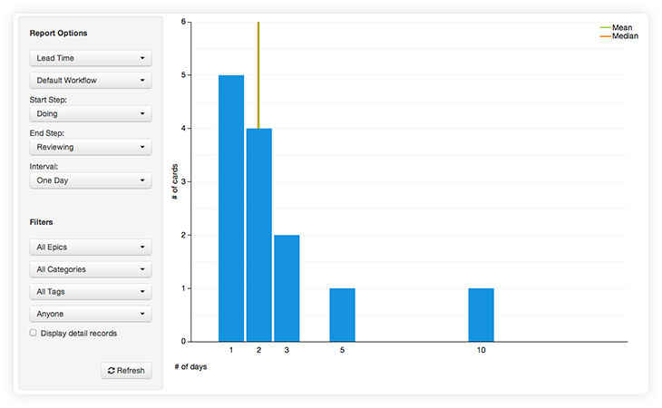
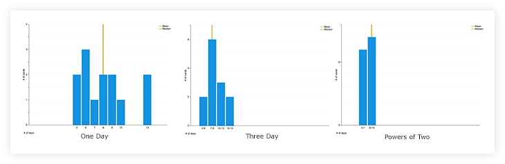

The Lead Time Histogram shows you how long work is taking to be completed.

**Start and End Step**

These options specify the step in the workflow that we should begin counting time, through when the work has been completed for this report.

When viewing this report, it's very important to make sure to select the start and end steps that you wish to view the data across.  For example, if you have a "done" column, you likely want to select it as your end-step.  If you don't, the time spent in that column waiting to be archived would be counted.

These options can also be very useful for slicing the data to get more specific information.  In the example below, the start step was set for doing, and the end step for reviewing.  In this sample project, those steps come right after one another (Todo, Doing, Reviewing, Done).  This results in a report that shows us how long work stayed in the Doing step.  The report tells me that most work is handled in the doing state in just 1-3 days, but occasionally it takes significantly longer (5 or 10 days).

**Interval**

The interval option allows you to control the grouping on the horizontal axis.  One or three days will cause each bar to represent either one or 3 days respectively.  Selecting the powers of 2 option will make the first bar represent one day, and then each subsequent bar represent 2, 4, 8... days.  

The following are three examples of the same data.

