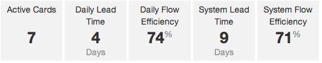

On your organizational dashboard, you'll see a series of stats for your Scrumban projects like the one below.

<b>Example Stats:</b>

#### Active Cards

The number of cards currently on the kanban board for this project.

#### Lead Time

Lead time is only calculated for completed cards.  It is the sum of the time it spent in cells that have been 
marked with the *Include in Lead Time calculations* option.  It will be measured in either hours or days depending
on the value.

The **Daily Lead Time** tells you the average lead time of cards completed over the previous day's time.  You
may see a value of n/a if no cards were completed in the calculation period.

The **System Lead Time** tells you the average lead time of all cards completed in a project.

#### Flow Efficiency

Flow efficiency is also only calculated for completed cards.  It takes the "work time" of a card and divides it by
the lead time of that card.  "Work time" is one of 4 types of time (wait, setup, work, done) a cell can be assigned 
when creating your board.

The **Daily Flow Efficiency** represents the average of cards completed over the previous day's time.

The **System Flow Efficiency** represents the average of all cards completed.

#### When stats are calculated

These stats are calculated once a day.