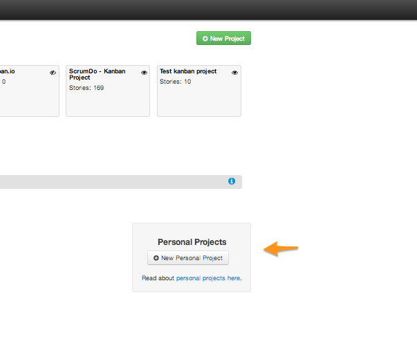

Personal Kanban is a very simple and effective way of managing life, family, school or work. It's a tool to help organize and increase your personal productivity. It's' simple to learn and use and is super easy to personalize.

### Tell me more...

Very simply a user would create a 'personal kanban board' to visualize, organize, analyze and manage their personal stuff.  It may relate to work or life  - to track things that only they care about.  Personal Boards are only viewable by the creator of the board.  These are great for things like:

#### Individual and families tracking personal work
- Honey-Do lists
- Personal career goals
- To-read lists
- Personal ideations
- Menu planning
- Vacation planning
- Home improvement projects
- Bucket lists 
- Get the idea?

#### Tracking school work
- Routine home work
- Special project work

#### Personal training routine
- Work out schedule
- Training goals

#### Product-Owner pre-planning
- Pre-planning may be done and then stories promoted to team board backlogs

#### Tracking confidential information
- Track employee performance
- Confidential contract status
- Financial and budget process approvals

#### CEO
- Portfolio initiative planning
- Sales tracking
- Budget planning

You can create either a timebox (iteration/sprint) based or a flow (iterationless/sprint less) based personal project.  

## Who can see my personal stuff?
Only you. Account owners or Staff members of your organization can see that the project exists, but CANNOT see the content of your personal project/board.

## Personal boards vs Team boards

* Third party extras are not available for personal projects.
* Newsfeed and activity emails are not generated for personal projects.
* Personal projects can not be part of a release.

Please note, personal projects do count against your organization's subscription limit.

## How to create a personal board

1. Select the "Projects" option from your organization's drop down menu in the top navbar. Of course, a home can be an organization. If personal projects are enabled for your organization, you'll see a button in the lower right hand corner labeled "New Personal Project".

2. You can choose a project to be an iteration based project or a personal Kanban board (Flow based). We recommend the latter because of it's flexibility.

3. You can choose a template or start from scratch. We recommend choosing the personal Kanban board template and then customizing it by renaming/adding/deleting as your work flow dictates. 

4. As you customize your work flow- don't forget to set the WIP limits for your swimlanes and or columns.

5. That's it! Go ahead and share it with your friends and family.

## Disabling personal projects

A staff member of your organization can enable or disable personal projects by going to the organization menu in the top navbar, selecting "Organization Admin", and turning the option off on the resulting page.

Do you need to get rid of just one personal project?  Email us support@scrumdo.com and we can help.
