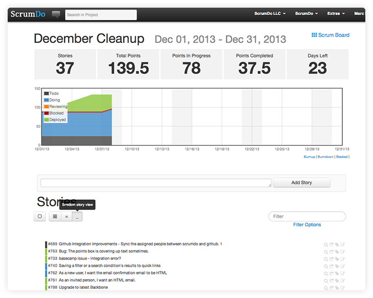

## Iteration

An iteration is a time-boxed (usually around 2 weeks) development effort.  Scrum projects are made up of a series of iterations.

In the screenshot below, you can see an iteration that's in progress.  It's using a smaller sized story view than the default so we can see more on a single page.  You can use the buttons directly over the stories to do this in your projects.

**Tip**: Need a holding area for a type of story?  You can create an iteration without dates for that.  At ScrumDo, we use this to have three different backlogs.  One for our website, one for our mobile app, and one for some operations tasks.
