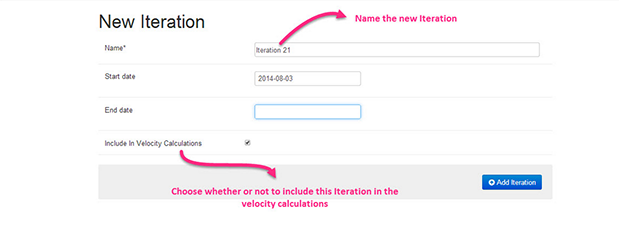
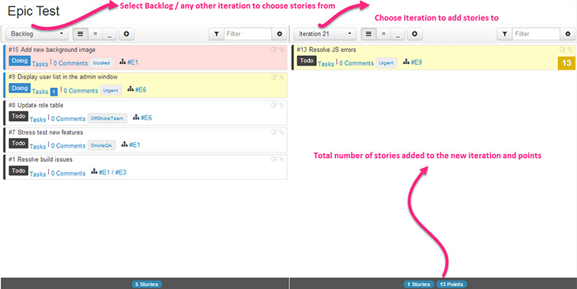

## Iteration Planning

Iteration Planning (or Sprint Planning) is an effective, easy-to-use tool in ScrumDo. The Iteration Planning page, available via both "Quick Links" and the project drop-down menu, gives your team everything they need to plan for a successful iteration.

To create a new iteration, click the green "Add Iteration" button in the Project drop down menu. Alternatively you can choose to add a new iteration from the Iteration Planning page by selecting New Iteration in the Backlog or selecting from the drop down. Either way, you’ll be taken to a New Iteration page where you will name the iteration, choose a start and end date, and decide whether or not to include the iteration in your velocity calculations. 

Once you've filled in the required fields, pressing the blue "Add Iteration" button will take you to the iteration's story list page. You can now begin adding stories to this iteration or go back to the planning page to choose stories from backlog. 

To get back to Iteration Planning, simply click the Iteration Planning Quick Link on the right.

The iteration planning page has two panels , one that defaults to containing your project backlog and the other for the iteration you are planning.  Your new iteration is now available in the Iteration drop-down in both the panels. You may choose what you wish to display in both panels based on your needs. 

Typically, users will elect to display all the stories in the backlog can be seen on the left (as in the image). The "filter" tool lets you search text or tags so you can see the relevant stories. It's easy to drag and drop stories from the backlog to the iteration. If the story has been sized, the story size will be added to a running tally of points per iteration that is continuously updated beneath the iteration panel.

Once all the stories for the iteration have been added from the backlog, you can arrange the stories in whatever order best suits your needs. Every story can also be updated or edited directly within the Iteration Planning page.