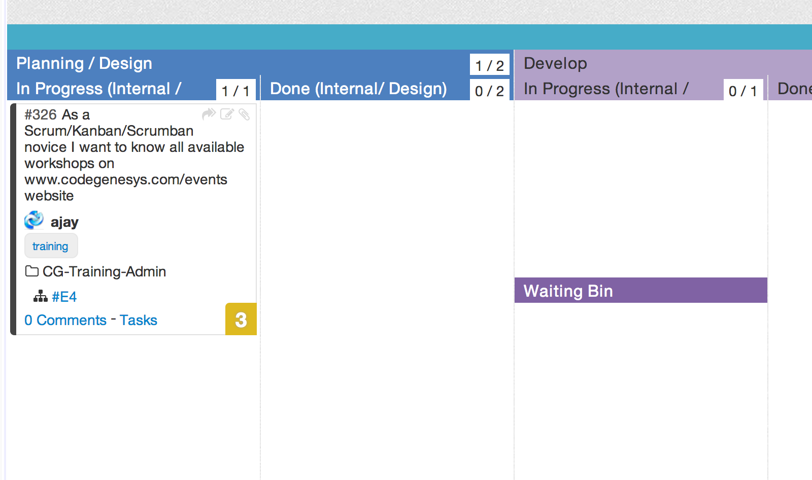
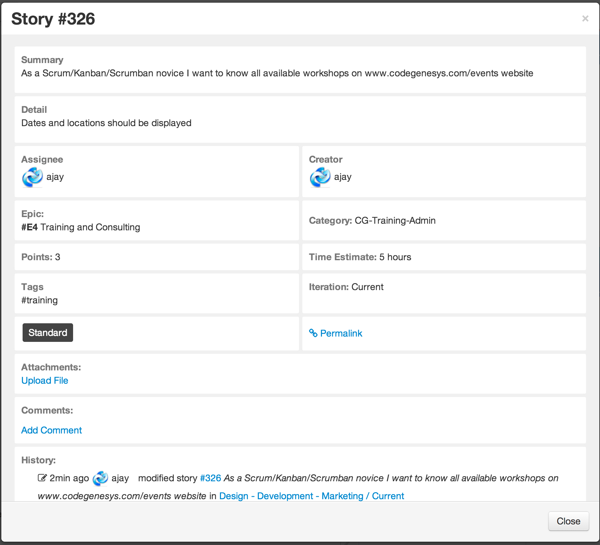

----

## User Story 

A user story represents a single piece of functionality, generally written in easy-to-read language from the users's perspective.  They are the main way that work that needs to be done is defined and worked on.

User stories typically have the following format:

As a (role) I want ( functionality) so that (business purpose).

Stories belong to epics or child epics. Stories can contain tasks.

In ScrumDo, we represent a story as a single card on the scrum board, or as an entry in the iteration view list.

You can click on any of the fields and modify the details from the story edit window

#### Good user stories

A good story has the following acronym's characteristics:
<ul>

<li>I – Independent.  We want to be able to move stories around, taking into account their relative priority.  This means stories are easiest to work with when they are independent.</li>
 
<li>N – Negotiable.  Stories are not an explicit commitment to produce certain features, but a framework for ultimately defining what to produce for the end user.  
 </li>
<li>V – Valuable. A story needs to be valuable to the end user. Development issues should be framed in a way that illustrate why the end user would perceive them as important.
 </li>
<li>E – Estimable. We want stories to be estimable, otherwise they're never likely to be tasked for development. Whether a story is estimable is a function of being negotiated (you can't estimate what you don't understand), a function of size (bigger stories are harder to estimate), and a function of team experience. </li>
 
<li>S – Small. Stories should be small -- no more than a few person-days of work.  Above this size it's almost impossible to know a story's full scope.
 </li>
<li>T – Testable. Finally, we want stories to be testable. If a story isn't testable, you can't really determine when it's done. Test Driven Development has shown us how actually writing the tests early helps us know whether the business goal is met.
</li>

